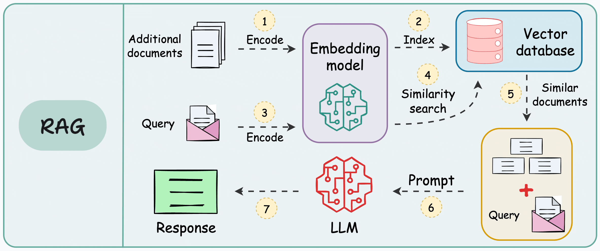
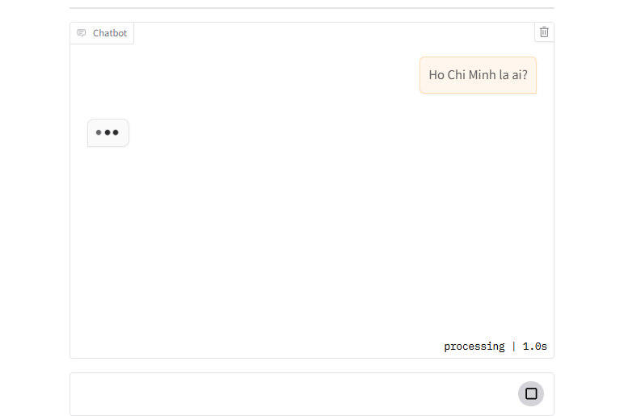

# Build Chatbot with Naive RAG (LangChain)
Notebook này triển khai nhanh việc xây dựng chatbot và truy xuất thông tin trên dữ liệu (document: PDF, doc,..) cá nhân bằng cách sử dụng truy vấn ngữ nghĩa (`Sematic retriever`) và truy vấn từ khóa (`Keywork retriever - BM25`) từ framework LangChain.


<!--  -->

## Giới thiệu về các công nghệ được sử dụng:
- Framework: `LangChain`
- LLM: `Gemini` (version: `gemini-2.0-flash`)
- Embedding: `Hugging Face` (model: `all-MiniLM-L6-v2`)
- Vector database: `Chroma BD`
- Keywork retriever: `BM25`

## Cách chạy
### 1. Clone hoặc tải xuống kho lưu trữ
```bash
git clone https://github.com/HuynhNghiaKHMT/Chatbot_RAG_Langchain
cd 01-Native-Rag
```

### 2. Cài đặt các thư viện cần thiết

```bash
pip install -r requirements.txt
```

### 3. Tạo API Key với Gemini
Truy cập vào trang [Google AI Studio API key](https://aistudio.google.com/app/apikey) để tạo API Key. Cấu hình đường dẫn sau vào tệp `.env`.

```bash
GOOGLE_API_KEY="YOUR API KEY"
```

### 4. Demo
Sử dụng thư viện `gradio` giúp ta tạo giao diện chatbot nhanh để thử nghiệm.




## Tài liệu tham khảo
* [Tự Tạo Chatbot AI Với Dữ Liệu Của Bạn | RAG Made Simple](https://github.com/tam1511/llmprojects/tree/main/chatbot)
* [Build An LLM RAG Chatbot With LangChain Python](https://github.com/kaizenX209/Build-An-LLM-RAG-Chatbot-With-LangChain-Python)
* [Ứng dụng Langchain xây dựng model hỏi đáp nội dung văn bản | Retrieval Augmented Generation - Mì AI](https://github.com/thangnch/MiAI_Langchain_RAG)