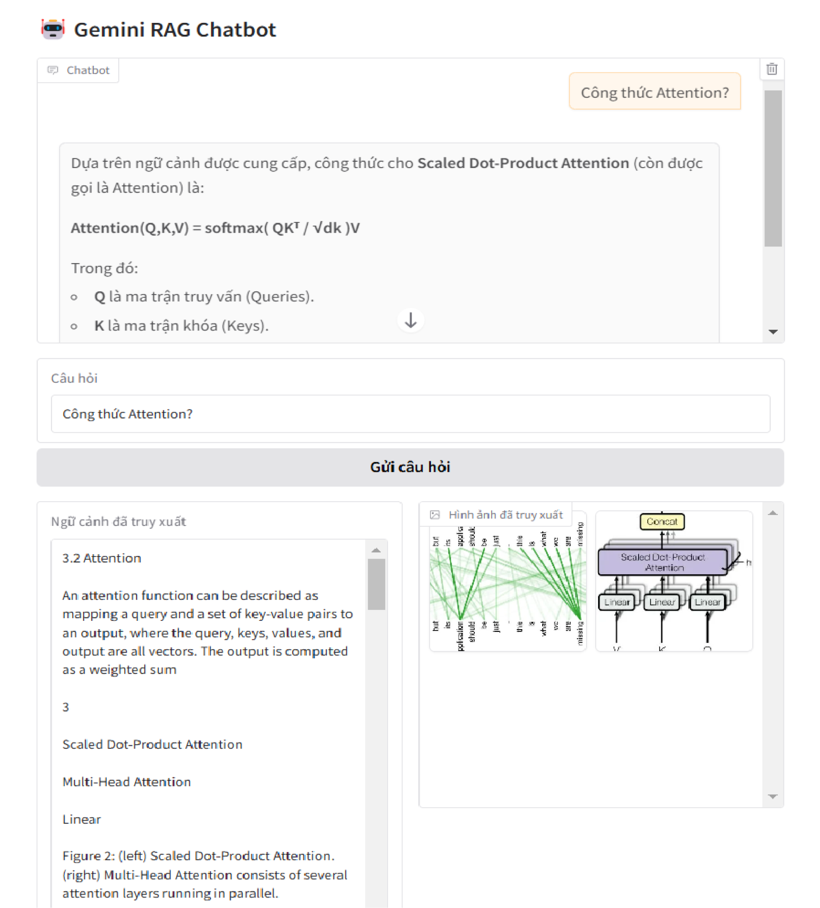

# Build Chatbot with Multimodal RAG (LangChain)
Notebook này triển khai nhanh việc xây dựng chatbot và truy xuất đa thông tin (text, table, image) trên dữ liệu cá nhân (document: PDF, doc, html, ...). Chúng ta sẽ thực hiện nhánh bên dưới bằng các tạo thêm các bản tóm tắt (Summarize) cho từng loại dữ liệu. Trong Repo này, hình ảnh sẽ được đưa trực tiếp vào LLM cùng với dữ liệu văn bản/ bảng gốc mà tôi đã trích xuất được.


## Giới thiệu về các công nghệ được sử dụng:
- Framework: `LangChain`
- LLM: `Gemini` (version: `gemini-2.5-flash`)
- Embedding: `Hugging Face` (model: `paraphrase-multilingual-MiniLM-L12-v2`)
- Summarize: `Groq` (model: `llama-3.1-8b-instant`) 
- Vector database: `Chroma BD`
- Extract document: `Docling`

## Cách chạy
### 1. Clone hoặc tải xuống kho lưu trữ
```bash
git clone https://github.com/HuynhNghiaKHMT/Chatbot_RAG_Langchain
cd 02-Multimodal-Rag
```

### 2. Cài đặt các thư viện cần thiết

```bash
pip install -r requirements.txt
```
Ngoài ra, bạn cần tải các gói và cài đặt vào biến môi trường (`environment variable`) như
[Poppler](https://github.com/oschwartz10612/poppler-windows/releases), 
[Tesseract-OCR](https://github.com/UB-Mannheim/tesseract/wiki)

### 3. Tạo API Key với Gemini
Truy cập vào trang [Google AI Studio API key](https://aistudio.google.com/app/apikey) để tạo API Key và trang [Quickstart - GroqDocs](https://console.groq.com/keys). Cấu hình đường dẫn sau vào tệp `.env`.

```bash
GOOGLE_API_KEY="YOUR API KEY"
GROQ_API_KEY="YOUR API KEY"
```

### 4. Demo
Sử dụng thư viện `gradio` giúp tạo giao diện chatbot nhanh để thử nghiệm.



## Tài liệu tham khảo
* [How to Use Multimodal RAG to Extract Text, Images, & Tables (with Demos)](https://github.com/debnsuma/fcc-ai-engineering-aws/tree/main/03-multimodal-rag)
* [Multimodal RAG: A Beginner-friendly Guide (with Python Code)](https://github.com/ShawhinT/YouTube-Blog/tree/main/multimodal-ai)
* [Multimodal RAG: Chat with PDFs (Images & Tables) [2025]](https://colab.research.google.com/gist/alejandro-ao/47db0b8b9d00b10a96ab42dd59d90b86/langchain-multimodal.ipynb)