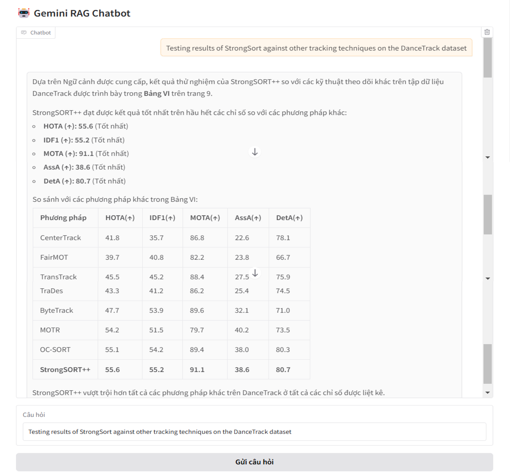
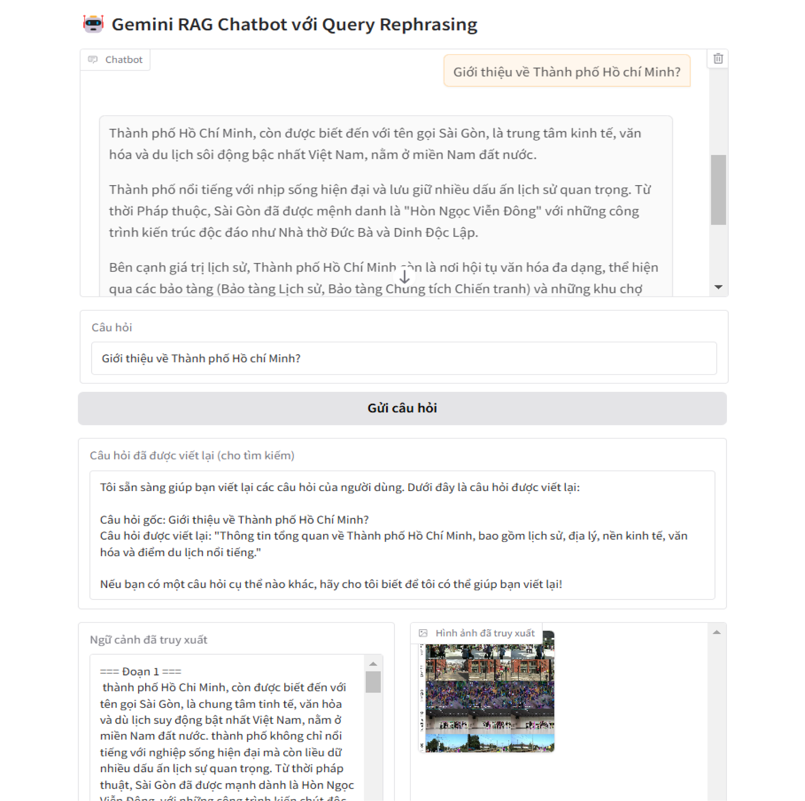

# Build Chatbot with Multimodal RAG (LangChain)
Notebook này là một phần mở rộng của `02-Multimodal-Rag`, không những truy xuất đa thông tin trong `document` (text, table, image) mà còn trên `audio`. Và sử dụng một số kĩ thuật tăng cường cho RAG:


**kĩ thuật `Retriever`:** truy vấn tài liệu liên quan.

- `Sematic retriever`: Truy vấn ngữ nghĩa của câu hỏi qua bản tóm tắt.
- `Keyword retriever`: Truy vấn từ khóa của câu hỏi trong nội dung gốc.

**kĩ thuật `Rerank`:** sắp xếp lại tài liệu liên quan từ top k tài liệu đã được truy xuất.

**kĩ thuật `Rewriting`:** viết lại câu hỏi của người dùng.


## Giới thiệu về các công nghệ được sử dụng:
- Framework: `LangChain`
- LLM: `Gemini` (version: `gemini-2.5-flash`)
- Embedding: `Hugging Face` (model: `paraphrase-multilingual-MiniLM-L12-v2`)
- Summarize: `Groq` (model: `llama-3.1-8b-instant`) 
- Speed to text: `OpenAI` (model: `whisper-tiny`)
- Vector database: `Chroma BD`

## Cách chạy
### 1. Clone hoặc tải xuống kho lưu trữ
```bash
git clone https://github.com/HuynhNghiaKHMT/Chatbot_RAG_Langchain
cd 03-Multimodal-Rag
```

### 2. Cài đặt các thư viện cần thiết

```bash
pip install -r requirements.txt
```
Ngoài ra, bạn cần tải các gói và cài đặt vào biến môi trường (`environment variable`) như
[Poppler](https://github.com/oschwartz10612/poppler-windows/releases), 
[Tesseract-OCR](https://github.com/UB-Mannheim/tesseract/wiki)

### 3. Tạo API Key với Gemini
Truy cập vào trang [Google AI Studio API key](https://aistudio.google.com/app/apikey) để tạo API Key và trang [Quickstart - GroqDocs](https://console.groq.com/keys). Cấu hình đường dẫn sau vào tệp `.env`.

```bash
GOOGLE_API_KEY="YOUR API KEY"
GROQ_API_KEY="YOUR API KEY"
```

### 4. Demo
Sử dụng thư viện `gradio` giúp tạo giao diện chatbot nhanh để thử nghiệm.

**Mutil_RAG_v1.ipynb:** Sử dụng kĩ thuật `Query Rewriting`.

**Mutil_RAG_v2.ipynb:** Sử dụng kĩ thuật `Hybrid Search`.

**Mutil_RAG_v3.ipynb:** Sử dụng kĩ thuật `Rerank`.






## Tài liệu tham khảo
* [How to Use Multimodal RAG to Extract Text, Images, & Tables (with Demos)](https://github.com/debnsuma/fcc-ai-engineering-aws/tree/main/03-multimodal-rag)
* [Multimodal RAG: A Beginner-friendly Guide (with Python Code)](https://github.com/ShawhinT/YouTube-Blog/tree/main/multimodal-ai)
* [Multimodal RAG: Chat with PDFs (Images & Tables) [2025]](https://colab.research.google.com/gist/alejandro-ao/47db0b8b9d00b10a96ab42dd59d90b86/langchain-multimodal.ipynb)